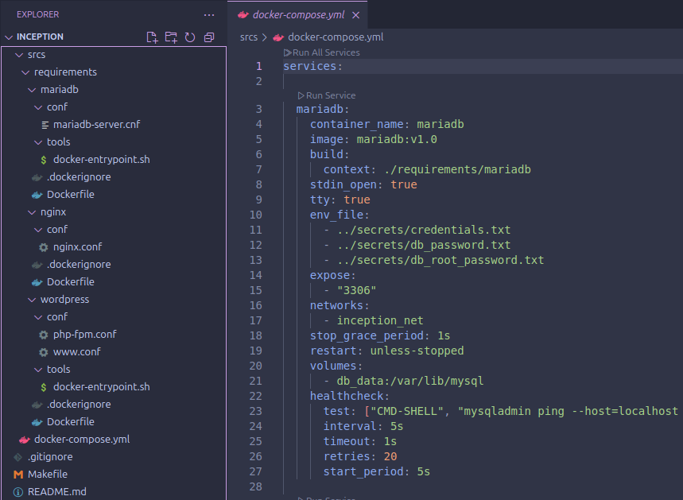

# Inception

## Overview

Inception is a school DevOps project that deploys a complete WordPress website using Docker. Instead of installing WordPress, NGINX, PHP, and MariaDB directly on a machine, the project separates them into dedicated containers that communicate over a private Docker network.



This repository was completed as a solo project for ecole 42.

- Project type: Intro to DevOps
- Goal: Deploy a WordPress-based web application using Docker
- Time spent: 2 months, August 2024 to September 2024
- Final grade: 100/100
- Bonus: Not completed

The result is a small production-style stack:

- NGINX serves the website over HTTPS.
- WordPress runs through PHP-FPM.
- MariaDB stores the WordPress database.
- Docker Compose builds and starts the full environment.
- Persistent volumes keep the website and database data after containers restart.

## What This Project Demonstrates

This project is not just a WordPress install. The main point is learning how the pieces of a web service fit together when each service runs in its own isolated environment.

The repository demonstrates:

- Building custom Docker images instead of relying on prebuilt WordPress, MariaDB, or NGINX images.
- Running multiple containers with Docker Compose.
- Connecting services through a private Docker bridge network.
- Serving only the public HTTPS entry point through NGINX.
- Using PHP-FPM as the runtime layer between NGINX and WordPress.
- Initializing a MariaDB database automatically on first container startup.
- Installing and configuring WordPress automatically with WP-CLI.
- Persisting application and database data outside the containers.
- Managing secrets through ignored environment files.

## Architecture

The stack is made of three services.

### NGINX

The NGINX container is the only service exposed to the host machine. It listens on port `443` and serves the WordPress site over TLS.

Important files:

- `srcs/requirements/nginx/Dockerfile`
- `srcs/requirements/nginx/conf/nginx.conf`

Notable behavior:

- Builds from Alpine Linux.
- Installs NGINX and OpenSSL.
- Generates a self-signed TLS certificate during image build.
- Redirects HTTP traffic to HTTPS.
- Forwards PHP requests to the WordPress container on port `9000`.
- Uses TLSv1.3.

### WordPress

The WordPress container runs PHP-FPM and prepares the WordPress installation.

Important files:

- `srcs/requirements/wordpress/Dockerfile`
- `srcs/requirements/wordpress/tools/docker-entrypoint.sh`
- `srcs/requirements/wordpress/conf/php-fpm.conf`
- `srcs/requirements/wordpress/conf/www.conf`

Notable behavior:

- Builds from Alpine Linux.
- Installs PHP, PHP-FPM, MariaDB client tools, and WP-CLI.
- Downloads WordPress.
- Creates `wp-config.php` from environment variables.
- Installs WordPress automatically if it has not already been installed.
- Creates an admin user and a normal author user.
- Runs PHP-FPM in the foreground so Docker can manage the process.

### MariaDB

The MariaDB container owns the database used by WordPress.

Important files:

- `srcs/requirements/mariadb/Dockerfile`
- `srcs/requirements/mariadb/tools/docker-entrypoint.sh`
- `srcs/requirements/mariadb/conf/mariadb-server.cnf`

Notable behavior:

- Builds from Alpine Linux.
- Installs MariaDB server and client utilities.
- Initializes the database only when the data directory is empty.
- Creates the configured database and user.
- Uses a healthcheck so WordPress waits until MariaDB is ready.
- Stores database files in a persistent Docker volume.

## Repository Layout

```text
.
|-- Makefile
|-- README.md
|-- README_NEW.md
`-- srcs
    |-- docker-compose.yml
    `-- requirements
        |-- mariadb
        |   |-- Dockerfile
        |   |-- conf
        |   |   `-- mariadb-server.cnf
        |   `-- tools
        |       `-- docker-entrypoint.sh
        |-- nginx
        |   |-- Dockerfile
        |   `-- conf
        |       `-- nginx.conf
        `-- wordpress
            |-- Dockerfile
            |-- conf
            |   |-- php-fpm.conf
            |   `-- www.conf
            `-- tools
                `-- docker-entrypoint.sh
```

## Docker Compose Setup

The main orchestration file is:

```text
srcs/docker-compose.yml
```

It defines:

- `mariadb`
- `wordpress`
- `nginx`
- `db_data` persistent volume
- `wp_data` persistent volume
- `inception_net` private Docker network

Only NGINX publishes a port to the host:

```yaml
ports:
  - "443:443"
```

MariaDB and WordPress use `expose`, which makes them reachable to other containers on the Docker network without publishing them to the host machine.

## Environment Files

Secrets are intentionally not committed. The `.gitignore` excludes:

```text
srcs/.env
secrets/*
```

The Compose file expects these files:

```text
srcs/.env
secrets/credentials.txt
secrets/db_password.txt
secrets/db_root_password.txt
```

The scripts and Compose file reference these environment variables:

```text
DOMAIN_NAME
SITE_TITLE
MYSQL_HOST
MYSQL_DATABASE
MYSQL_USER
MYSQL_PASSWORD
MYSQL_ROOT_PASSWORD
PRIV_USER
PRIV_PASSWORD
PRIV_EMAIL
PUB_USER
PUB_PASSWORD
PUB_EMAIL
```

Example values:

```env
DOMAIN_NAME=dpentlan.42.fr
SITE_TITLE=Inception
MYSQL_HOST=mariadb
MYSQL_DATABASE=wordpress
MYSQL_USER=wp_user
MYSQL_PASSWORD=change_me
MYSQL_ROOT_PASSWORD=change_me_too
PRIV_USER=admin
PRIV_PASSWORD=admin_password
PRIV_EMAIL=admin@example.com
PUB_USER=author
PUB_PASSWORD=author_password
PUB_EMAIL=author@example.com
```

## How To Run

Before running the project, Docker and the Docker Compose plugin must be installed.

Start the stack:

```bash
make
```

or:

```bash
make up
```

Stop the stack:

```bash
make down
```

Show containers, images, volumes, and networks:

```bash
make status
```

Remove containers, unused images, unused volumes, and unused networks:

```bash
make clean
```

Rebuild from a clean state:

```bash
make re
```

Open a shell inside a service:

```bash
make serv_test
make db_test
make wp_test
```

## Hostname And Data Paths

This project was built for the 42 Inception evaluation environment, where the site is expected to run on a custom local domain.

The current NGINX configuration uses:

```text
dpentlan.42.fr
```

For local testing, the host machine needs an entry in `/etc/hosts`:

```text
127.0.0.1 dpentlan.42.fr
```

The Compose file also bind-mounts persistent data to:

```text
/home/dpentlan/data/mariadb
/home/dpentlan/data/wordpress
```

If another user runs this project, those paths should be updated in `srcs/docker-compose.yml` or created manually. The Makefile creates similar directories under `/home/$(USER)/data`, but the Compose file currently contains the explicit `dpentlan` paths.

## Typical Student Challenges

### Building Custom Images

The project rules commonly require students to build their own images instead of using convenience images like `wordpress:latest` or `mariadb:latest`. That means each Dockerfile must install packages, copy configuration files, and start the correct foreground process manually.

This is harder than a normal tutorial because the containers must behave like real services, not temporary setup scripts.

### Container Startup Order

WordPress cannot finish its setup until MariaDB is ready to accept connections. This project handles that with a MariaDB healthcheck and a `depends_on` condition in Docker Compose.

Without this, WordPress may start too early, fail to connect to the database, and produce inconsistent startup behavior.

### First-Boot Initialization

MariaDB and WordPress both need initialization logic that only runs once.

MariaDB checks whether `/var/lib/mysql/mysql` already exists. If it does, the script skips database creation and starts the existing database.

WordPress checks whether the site is already installed with:

```bash
wp core is-installed
```

This distinction is important because containers are disposable, but the data volumes are persistent. Restarting a container should not erase or recreate the website.

### Persistent Volumes

The project uses persistent volumes for:

- MariaDB data at `/var/lib/mysql`
- WordPress files at `/var/www/html/wordpress`

This is one of the most important DevOps lessons in the project: container filesystems are temporary, so important application state must live outside the container.

### NGINX And PHP-FPM Separation

NGINX does not execute PHP itself. It serves static files and forwards `.php` requests to PHP-FPM in the WordPress container.

That requires matching several pieces correctly:

- NGINX document root
- WordPress volume mount path
- PHP-FPM listen address
- FastCGI parameters
- Docker service name resolution

A small mismatch in any of those areas can lead to `404`, `502 Bad Gateway`, or blank PHP responses.

### TLS Configuration

The project exposes the site through HTTPS only. The NGINX image generates a self-signed certificate during the build and configures TLS in `nginx.conf`.

This is challenging because students must understand the difference between:

- exposing a container port,
- configuring NGINX to listen on that port,
- creating a certificate,
- and making the browser trust or accept that certificate.

### Secrets And Configuration

The project keeps credentials outside Git with ignored environment files. This is a practical habit: code can be shared, but passwords and local deployment details should not be committed.

It also makes the application configurable without changing the Dockerfiles or shell scripts.

## What I Learned

This project is a practical introduction to DevOps because it forces the developer to think about the full lifecycle of a small web application:

- how services are built,
- how they start,
- how they find each other,
- how they keep data,
- how they expose a secure public entry point,
- and how they recover after a restart.

The final stack is intentionally small, but it covers the same core concerns found in larger deployments: isolation, networking, persistence, configuration, startup orchestration, and service ownership.
